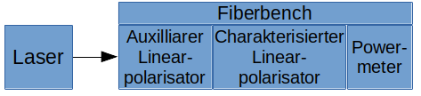
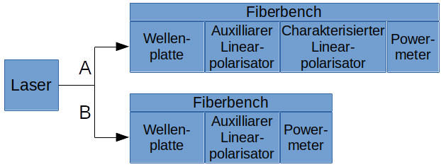
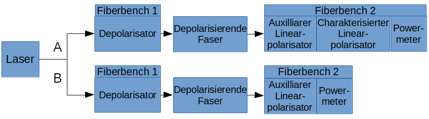
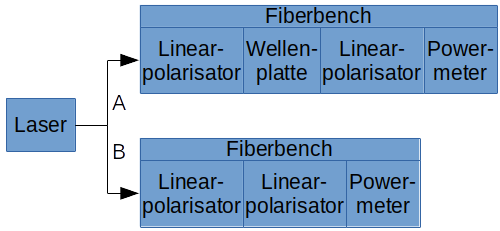
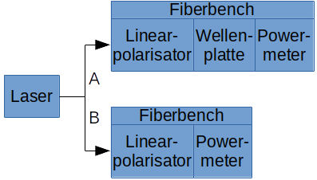
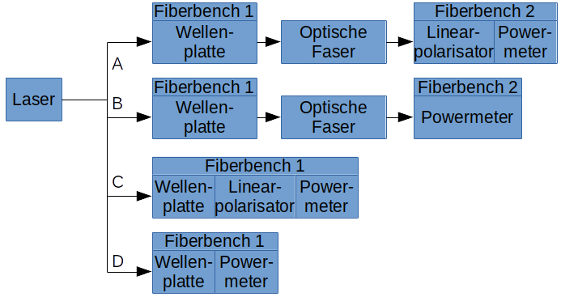
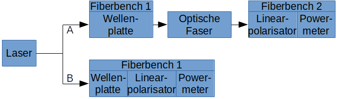
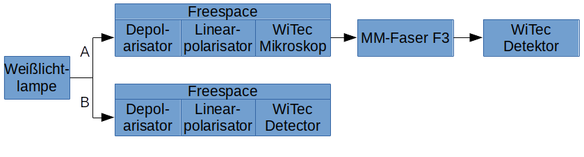
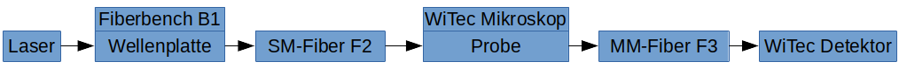

```{r}
library(RHotStuff)
library(ggplot2)
library(magrittr)
library(fields)
```


## __Charakterisierung der Bauteile__

### __Linearpolarisatoren__

#### __Experiment__

Es werden zwei Experimente durchgeführt:

1. Nullpunktbestimmung: Welche Position des Linearpolarisators ist parallel/orthogonal zum Laser?
2. Transmissionsverhalten: Ist der Linearpolarisator unterschiedlich durchlässig für einen parallel polarisierten Laser, wenn sowohl der Laser als auch der Polarisator im gleichen Maß gedreht werden?

__Nullpunktsbestimmung von Linearpolarisatoren__:



Durchführung:

+ Auxilliar Polarisator parallel zum Laser ausrichten
+ Leistung für verschiedene Rotationen des zu charakterisierenden Polarisators

__Transmissionsverhalten von Linearpolarisatoren__ (Variante eine Fiberbench):



Durchführung:

+ Verwendet für Polarisatoren, die nur eine Position in der Fiberbench einnehmen
+ Für beliebige Positionen der Wellenplatte werden folgende Schritte wiederholt
+ Der auxilliare Polarisator wird so gedreht, dass die Transmission maximal ist
+ Der zu charaktarisierende Polarisator wird so gedreht, dass die Transmission maximal ist
+ Leistung wird vor und hinter den zu charakterisierenden Polarisator gemessen

__Transmissionsverhalten von Linearpolarisatoren__ (Variante zwei Fiberbenches):



Durchführung:

+ Für beliebige Positionen des zu charakterisierenden Linearpolarisators wird der Auxilliarpolarisator auf maximale Transmission gedreht
+ Die Leistung wird vor und hinter dem zu charakterisierenden Polarisator gemessen


#### __Auswertung__

__Nullpunktbstimmung__

+ Herunterladen von Messdaten
+ Normalisieren der Daten mit der Leistung gemessen ohne Linearpolarisator
```{r}
#
# LINEARPOLARISATOR P1
#
# Extract Data from eLabFTW
P1.maxmin.metadata <- GET.elabftw.byselector(25, node.selector = "#meta-data")[[1]]
P1.maxmin.data <- GET.elabftw.byselector(25, header = T)[[1]]

# Normalise data
P1.maxmin.data$Y1 <- P1.maxmin.data$Y1 / P1.maxmin.metadata[3,2] *100

#
# LINEARPOLARISATOR P2
#
# Extract Data from eLabFTW
P2.maxmin.metadata <- GET.elabftw.byselector(26, node.selector = "#meta-data")[[1]]
P2.maxmin.data <- GET.elabftw.byselector(26, header = T)[[1]]

# Normalise data
P2.maxmin.data$Y1 <- P2.maxmin.data$Y1 / P2.maxmin.metadata[3,2] *100
```

__Winkelabhängige Transmission__

+ Herunterladen der Messdaten
+ Ggf. .csv Dateien auslesen und den Mittelwert (unter Vernachlässigung der ersten und letzten 10%-Quantille) der gemessenen Leistungen nehmen
+ Normalisieren mit der Leistung hinter dem Polarisator mit der Leistung vor dem Polarisator

```{r}
#
# LINEARPOLARISATOR P1
#
# Extract data from eLabFTW
P1.transmission.data <- GET.elabftw.byselector(29, header = T)[[1]]

# Normalise data
P1.transmission.data$Y4 <- P1.transmission.data$Y4/P1.transmission.data$Y2 *100

#
# LINEARPOLARISATOR P2
#
# Extract data from eLabFTW
P2.transmission.data <- GET.elabftw.byselector(30, header = T)[[1]]

# Normalise data
P2.transmission.data$Y4 <- P2.transmission.data$Y4/P2.transmission.data$Y2 *100

#
# LINEARPOLARISATOR P3
#
# Extract data from elabFTW
P3.absorbance <- GET.elabftw.bycaption(78, header=T, outputHTTP=T) %>% 
                  parseTable.elabftw(., func=function(x) qmean(x[,4], 0.8, na.rm=T, inf.rm=T),
                                     header=T, skip=14, sep=";") %>% 
                  .[[1]]
colnames(P3.absorbance) <- c("P3", "P4", "background", "measured")

# Normalise data
P3.absorbance$transmittance <- P3.absorbance$measured / P3.absorbance$background
```


##### __Linearpolarisator P1__

```{r}
# Plot Zero Point
ggplot(data = P1.maxmin.data, mapping = aes(x = X, y = Y1)) +
  geom_point(size = 0.5) +
  theme_minimal() +
  labs(title = "Die Durchlässigkeit des Linearpolarisators P1 in Abhänigkeit des Rotationswinkels",
       x = "Winkel / °",
       y = "Anteil der Strahlung, die den Polarisator passiert / %")

# Plot Transmissionsverhalten
ggplot(data = P1.transmission.data, mapping = aes(x = Y3, y = Y4)) +
  geom_point() +
  theme_minimal() +
  labs(title = "Winkelabhängige Transmission von Linearpolarisator P1",
       x = "Rotationswinkel / °",
       y = "Anteil der Strahlung, die den Polarisator passieren / %")

```
__Fazit:__

+ Rotation parallel zu Laser: 6°, 192°
+ Rotation orthogonal zu Laser: 102°, 280°
+ Transmissionsverhalten schwankt wenig und scheint keinem Muster zu folgen (+/- 0.5%?)
+ Transmittiert ca. 85.6%

##### __Linearpolarisator P2__

```{r}
# Plot Zero Point
ggplot(data = P2.maxmin.data, mapping = aes(x = X, y = Y1)) +
  geom_point(size = 0.5) +
  theme_minimal() +
  labs(title = "Die Durchlässigkeit des Linearpolarisators P2 in Abhänigkeit des Rotationswinkels",
       x = "Winkel / °",
       y = "Anteil der Strahlung, die den Polarisator passiert / %")

# Plot Transmissionsverhalten
ggplot(data = P2.transmission.data, mapping = aes(x = Y3, y = Y4)) +
  geom_point() +
  theme_minimal() +
  labs(title = "Winkelabhängige Transmission von Linearpolarisator P2",
       x = "Rotationswinkel / °",
       y = "Anteil der Strahlung, die den Polarisator passieren / %")

```
__Fazit:__

+ Rotation parallel zu Laser: 158°, 340°
+ Rotation orthogonal zu Laser: 72°, 250°
+ Transmissionsverhalten schwankt wenig und scheint keinem Muster zu folgen (+/- 0.5%?)
+ Transmittiert ca. 86.2%

##### __Linearpolarisator P3__

```{r}
# Plot transmission behaviour
# Does the transmittance of the linear polariser change when rotating the polariser and the laser in the same manner?
ggplot(data = P3.absorbance,
       mapping = aes(x = P3, y = transmittance*100) ) +
  geom_bar(stat="identity") +
  theme_classic() +
  theme( axis.text = element_text(size=12),
         axis.text.x = element_text(angle = 90, vjust = 0.5, hjust=1),
         panel.grid.major.y = element_line("black", size = 0.1),
         panel.grid.minor.y = element_line("grey", size = 0.5) ) +
  scale_y_continuous(expand = c(0,0)) +
  scale_x_continuous(breaks = P3.absorbance$P3) +
  labs(title = expression(bold("The maximal transmittance of the linear polariser P3")),
       x = expression(bold("rotation of P3 or the lasers plane of polarisation / °")),
       y = expression(bold("transmittance / %"))
       )

```
__Fazit:__

+ Transmission schwankt wenig (stärker als P1/P2) und scheint keinem Muster zu folgen (+/- 1% bis zu 2.5%)
+ Transmittiert ca. 60% (weniger als P1/P2)


### __Wellenplatten__

#### __Experiment__

Es werden zwei Experimente durchgeführt:

1. Nullpunktsbestimmung: Wie muss die Wellenplatte orientiert sein, um die Laserpolarisation um 90° zu drehen?
2. Transmissionsverhalten: Absorbiert die Wellenplatte unterschiedlich für verschiedene Orientierungen der Wellenplatte?

__Nullpunktbestimmung von Wellenplatten:__



Durchführung:

+ Der erste Linearpolarisator wird parallel zum Laser ausgerichtet
+ Der zweite Linearpolarisator wird orthogonal zum Laser ausgerichtet
+ Für verschiedene Positionen der Wellenplatte wird die Leistung sowohl mit als auch ohne Wellenplatte gemessen

__Winkelabhängiges Transmissionsverhalten von Wellenplatten:__



Durchführung:

+ Der Linearpolarisator wird parallel zum Laser ausgerichtet
+ Für verschiedene Positionen der Wellenplatte wird die Leistung vor und hinter der Wellenplatte gemessen


#### __Auswertung__

__Nullpunkt/Transmissionsverhalten:__

+ Herunterladen der Messdaten
+ Sich wiederholende Daten sind mit NA abgekürzt -> Ersetzen von NA duch die letzte Zahl in der Spalte
+ Normalisieren der Messwerte mit der Leistung ohne der Wellenplatte

```{r}
#
# Wave Plate W1
#
# Extract data from eLabFTW
W1.data <- GET.elabftw.byselector(27, header = T)[[1]]

# Replace NA values by using the previous value in the vector
fillVector <- function(vector) {
  for (index in seq_along(vector)) {
    if (is.na(vector[index])) { vector[index] <- vector[index-1] }
  }
  return(vector)
}
W1.data$Y2 <- fillVector(W1.data$Y2)
W1.data$Y4 <- fillVector(W1.data$Y4)

# Normalise
W1.data$Y1 <- (W1.data$Y1/W1.data$Y2) *100
W1.data$Y3 <- (W1.data$Y3/W1.data$Y4) *100

#
# Wave Plate W2
#
# Extract data from eLabFTW
W2.data <- GET.elabftw.byselector(28, header = T)[[1]]

# Replace NA values by using the previous value in the vector
fillVector <- function(vector) {
  for (index in seq_along(vector)) {
    if (is.na(vector[index])) { vector[index] <- vector[index-1] }
  }
  return(vector)
}
W2.data$Y2 <- fillVector(W2.data$Y2)
W2.data$Y4 <- fillVector(W2.data$Y4)

# Normalise
W2.data$Y1 <- (W2.data$Y1/W2.data$Y2) *100
W2.data$Y3 <- (W2.data$Y3/W2.data$Y4) *100
```


##### __Wellenplatte W1__

```{r}
# Plot Transmissionverhalten
ggplot(data = W1.data, mapping = aes(x = X, y=Y3)) +
  geom_point() +
  theme_minimal() +
  labs(title = "Durchlässigkeit der Wellenplatte W1 in Abhängigkeit des Rotationswinkels",
       x = "Rotationswinkel / °",
       y = "Anteil der Strahlung, die die Wellenplatte passiert / %")
# Plot Nullpunktsbestimmung
ggplot(data = W1.data, mapping = aes(x=X, y=Y1)) +
  geom_point(size=0.5) +
  theme_minimal() +
  labs(title = "Nullpunktsbestimmung der Wellenplatte W1",
       x = "Rotationswinkel / °",
       y = "Gesteigerte Transmission durch die Wellenplatte / %")

```

__Fazit:__

+ Wellenplatte rotiert Polarisation um  0° bei:       358°,  90°, 180°, 268°
+ Wellenplatte rotiert Polarisation um 90° bei: ~[40°;50°], 134°, 224°, 314°
+ Wellenplatte transmittiert gut (~98%)
+ Transmission schwankt ein wenig (bis zu 2.3%)
+ Transmission scheint bei großen Rotationswinkeln zu sinken; es gibt allerdings viele Ausreißer


##### __Wellenplatte W2__

```{r}
# Plot Transmissionsverhalten
ggplot(data = W2.data, mapping = aes(x = X, y=Y3)) +
  geom_point() +
  theme_minimal() +
  labs(title = "Durchlässigkeit der Wellenplatte W2 in Abhängigkeit des Rotationswinkels",
       x = "Rotationswinkel / °",
       y = "Anteil der Strahlung, die die Wellenplatte passiert / %")
# Plot Nullpunktbestimmung
ggplot(data = W2.data, mapping = aes(x=X, y=Y1)) +
  geom_point(size=0.5) +
  theme_minimal() +
  labs(title = "Nullpunktsbestimmung der Wellenplatte W2",
       x = "Rotationswinkel / °",
       y = "Gesteigerte Transmission durch die Wellenplatte / %")
```

+ Wellenplatte rotiert Polarisation um  0° bei: 350°,  82°, 172°, 262°
+ Wellenplatte rotiert Polarisation um 90° bei:  42°, 128°, 216°, 206°
+ Wellenplatte transmittiert sehr gut (~96.5%)
+ Transmission schwankt ein wenig (bis zu 2.3%)
+ Transmission verhält sich vielleicht periodisch? Es gibt allerdings viele Ausreißer.


### __Optische Fasern__

#### __Experiment__

Es werden drei Experimente durchgeführt:

1. Messung der Stokesvektoren: Die Stokesvektoren werden vor und nach Passieren der optischen Faser für verschiedene Laserpolarisationen bestimmt
2. Messfehler der Stokesvektoren: Die Stokesvektoren werden wiederholt für die selbe initiale Laserpolarisation gemessen, um den Messfehler abzuschätzen
3. Rotation der Polarisationsebene: Es wird gemessen wie stark und in welche Richtung die Faser die Polarisationsebene des Lasers dreht

__Messung der Stokesvektoren:__



Duchführung:

1. Zuerst wird je ein Koordinatensystem für jede Fiberbench definiert:
+ Die Wellenplatte wird für diesen Schritt aus dem Aufbau entfernt
+ Für beide Fiberbenchens wird der Linearpolarisator parallel zum Laser ausgerichtet. Die Polarisatorposition wird als 0° definiert.
+ Für beide Fiberbenchens wird der Linearpolarisator orhtogonal zum Laser ausgerichtet. Die Polarisatorposition wird als 90° definiert.
+ Für beide Fiberbenchens wird der Linearpolarisator erneut parallel zum Laser ausgerichtet. Die Polarisatorposition wird als 180° definiert.
2. Der Stokesvektor wird gemessen, indem für 0°, 45°, 90° und 135° folgende Messung wiederholt wird:
+ Die Laserleistung wird analog zur Abbildung für die Aufbauten A, B, C und D gemessen
+ Dieser Schritt wird für beliebige Positionen der Wellenplatte wiederholt

__Rotation der Polarisationsebene:__



Duchführung:

+ Für beliebige Positionen der Wellenplatte wird der Linearpolarisator parallel zum Laser gedreht
+ Die Polarisatorposition wird vor und nach der optischen Faser notiert

#### __Auswertung__

Definition von Funktionen, die die Messdaten auswerten:

+ Berechnen der Stokesvektoren aus dem gemessenen Laserleistungen (Definiert in RHotStuff)
+ Stokesvektoren auf den ersten Stokesparameter normieren
+ Berechnen des Polarisationsgrades
+ Berechnen der Änderung der Lasereigenschaften durch die Faser (Änderung der Polarisation, Lichtintensität, ...)
+ Berechnen von Mittelwert, Standardabweichung und Varianz für die wiederholte Messung der selben Laserpolarisation
+ Erstellen von Funktionen, die Graphen produzieren. Die Änderung 

```{r}
#
# CALCULATE STOKES VECTORS AND THEIR PROPERTIES
#
# Normalise stokes vector and compute polarisation ratio and such shit
# ASSUMPTION: S3 = 0
process.stokesVec <- function(stokes) {
  # Compute properties of stokes vectors and normalise -> polarisation ratio, ...
  stokes <- lapply(stokes, function(table) { 
    # Normalise stokes vectors
    table[,c("S0", "S1", "S2")] <- table[,c("S0", "S1", "S2")] / table$S0
    
    # Polarisation ratio
    table$polarisation <- sqrt(table$S1^2 + table$S2^2) / table$S0
    
    # Polar stokes angle
    table$sigma <- better.acos( table$polarisation*table$S0, table$S1, table$S2)
    
    # Polar electrical field coordinate
    # !!! Keep in mind: This may be bullshit, if the polarisation ratio is smaller than one!
    # I'm to 90% sure that this conversion is also valid for partially polarised light
    table$epsilon <- table$sigma / 2
    
    # Return result
    return(table)
  })
  
  # CALCULATE CHANGE OF THE STOKES VECTORS PROPERTIES
  # Change in epsilon, change in polarisation, change in laser intensity
  stokes[["change"]]   <- data.frame("W"                      = stokes$PRE$W,
                                     # How much gets the plane of polarisation rotated?
                                     # Calculate the difference as smallest signed distance between two modular numbers
                                     # !!! Keep in mind: This is bullshit, if the polarisation ratio is smaller than one!
                                     "mod.change.in.epsilon"  = better.subtraction(stokes$POST$epsilon - stokes$PRE$epsilon, base=  pi),
                                     "mod.change.in.sigma"    = better.subtraction(stokes$POST$sigma   - stokes$PRE$sigma  , base=2*pi),
                                     # How much does the polarisation ratio change?
                                     "change.in.polarisation" = stokes$POST$polarisation / stokes$PRE$polarisation - 1,
                                     # How much does the intensity of the light change?
                                     "change.in.intensity"    = stokes$POST$I / stokes$PRE$I
  )
  
  return(stokes)
  
}
#
# DO THE STATISTICS
#
# error.stokes contains the data for several identical measurements
# following function will therefore compute statistical properties 
# like sd or mean for every column of the tables
# !!! Keep in mind: The statistics for the angles sigma and epsilon are not done with modular functions
#                   The modular numbers sigma and epsilon will therefore have the wrong mean, variance, sd, ...
#                   In this case only the modular calculated difference can be trusted.
do.statistics <- function(error.stokes) {
  lapply(error.stokes, function(table) {
    stats.table <- data.frame( var  = sapply(table, var ),
                               sd   = sapply(table, sd  ),
                               mean = sapply(table, mean)
    )
    return(stats.table)
  }) %>% return
  
  
  # TODO: t-Test, Kruskal-Wallis-Test
}

#
#   PLOT THAT SHIT
#
# How does the POLARSATION RATIO change RELATIVE to the initial polarisation ratio?
plot.polarisation.change <- function(data, 
                                     title = expression(bold("The Depolarising Behaviour Of <YOUR OPTICAL FIBER>"))
                                     ) {
  # EXPECTED PARAMETERS:
  # data : processedStokesExperiments (output of process.stokesVec)
  # title : expression(bold("The Depolarising Behaviour Of <YOUR OPTICAL FIBER>"))
  
  # Create the plot
  ggplot(data    = data$change,
         mapping = aes(x = as.factor(W), y = change.in.polarisation*100) ) +
    geom_bar(stat="identity") +
    theme_classic() +
    theme( axis.text = element_text(size=12),
           panel.grid.major.y = element_line("black", size = 0.1),
           panel.grid.minor.y = element_line("grey", size = 0.5) ) +
    labs(title = title,
         x = expression(bold("the have-waveplates angle of rotation "*omega*" / °")),
         y = expression(bold("the relative change in the ratio of polarisation "*Delta*Pi*" / %")) )
  
}

# COMPARING POLARISATION RATIOS before and after interacting with the fiber
plot.polarisation <- function(data,
                              statistics,
                              title = expression(bold("The Effect Of An <YOUR OPTICAL FIBER> On The Polarisation Ratio "*Pi)) 
                              ) {
  # PARAMETERS
  # data : processedStokesExperiments (output of process.stokesVec)
  # statistics : processsedErrorMeasurementExperiment (output of process.stokesVec)
  # title : expression(bold("The Effect Of An <YOUR OPTICAL FIBER> On The Polarisation Ratio "*Pi))
  
  ggplot(data = data.frame(W = c(data$POST$W, data$PRE$W),
                           polarisation = c(data$POST$polarisation, data$PRE$polarisation),
                           group = c( rep("B_POST", length(data$POST$W)), rep("A_PRE", length(data$PRE$W)) )
                          ),
        mapping=aes(x=as.factor(W), y=polarisation*100, fill=group)) +
    geom_bar(stat="identity", position = "dodge") +
    theme_classic() +
    scale_y_continuous(breaks = seq(from=0, to=110, by=10),
                       expand=c(0,0)) +
    theme(axis.text = element_text(size=12),
          panel.grid.major.y = element_line("black", size = 0.1),
          panel.grid.minor.y = element_line("grey", size = 0.5) ) +
    labs(title = title,
         x     = expression(bold("the have-waveplates angle of rotation "*omega*" / °")),
         y     = expression(bold("the polarisation ratio "*Pi*" / %")),
         fill  = "" ) +
    scale_fill_discrete( labels=c( expression(bold("before")), expression(bold("after")) ) ) +
    geom_errorbar(data=data.frame(W     = c(data$PRE$W, data$POST$W) %>% as.factor, 
                                  upper = c(data$PRE$polarisation+statistics$POST["polarisation","sd"]*3, data$POST$polarisation+statistics$POST["polarisation","sd"]*3)*100,
                                  lower = c(data$PRE$polarisation-statistics$POST["polarisation","sd"]*3, data$POST$polarisation-statistics$POST["polarisation","sd"]*3)*100,
                                  group = c( rep("A_PRE", length(data$POST$W)), rep("B_POST", length(data$PRE$W)) ),
                                  polarisation = c(data$PRE$polarisation, data$POST$polarisation) ),
                  mapping = aes(x=W, ymin = lower, ymax=upper, group=group),
                  position = "dodge"
    ) 
}

# CHANGE in LASER POWER due to optical fiber
plot.intensity.change <- function(data, 
                                  title = expression(bold("The Transmittance Of <YOUR OPTICAL FIBER>"))
                                  ) {
  # EXPECTED PARAMETERS:
  # data : processedStokesExperiments (output of process.stokesVec)
  # title : expression(bold("The Depolarising Behaviour Of <YOUR OPTICAL FIBER>"))
  
  ggplot( data    = data$change, 
          mapping = aes(x = as.factor(W), y = change.in.intensity*100) ) +
    geom_bar(stat="identity") +
    theme_classic() +
    theme(axis.text = element_text(size=12),
          panel.grid.major.y = element_line("black", size = 0.1),
          panel.grid.minor.y = element_line("grey", size = 0.5) ) +
    labs(title = title,
         x = expression(bold("the have-waveplates angle of rotation "*omega*" / °")),
         y = expression(bold("the transmitted part of the laser P"[trans]*" / %")) )
}


# COMPARING LASER POWER before and after interacting with the fiber
plot.intensity <- function(data, 
                           title = expression(bold("The Effect Of <YOUR OPTICAL FIBER> On The Lasers Power "*P))
                          ) {
  # EXPECTED PARAMETERS:
  # data : processedStokesExperiments (output of process.stokesVec)
  # title : expression(bold("The Depolarising Behaviour Of <YOUR OPTICAL FIBER>"))
  
  ggplot(data = data.frame(W = c(data$POST$W, data$PRE$W),
                           intensity = c(data$POST$I, data$PRE$I) /  data$PRE$I,
                           group = c( rep("B_POST", length(data$POST$W)), rep("A_PRE", length(data$PRE$W)) )
                          ),
         mapping=aes(x=as.factor(W), y=intensity*100, fill=group)) +
    geom_bar(stat="identity", position = "dodge") +
    theme_classic() +
    theme(axis.text = element_text(size=12),
          panel.grid.major.y = element_line("black", size = 0.1),
          panel.grid.minor.y = element_line("grey", size = 0.5) ) +
    labs(title = title,
         x     = expression(bold("the have-waveplates angle of rotation "*omega*" / °")),
         y     = expression(bold("the normalised laser power "*P*" / %")),
         fill  = "" ) +
    scale_fill_discrete( labels=c( expression(bold("before")), expression(bold("after")) ) )  
}


# How does the fiber influence the PLANE OF POLARISATIONS ORIENTATION?
plot.plane.rotation <- function(data, 
                                title = expression(bold("The Impact Of The <YOUR FIBER> On The Orientation Of The Plane Of Polarisation")) 
) {
  # EXPECTED PARAMETERS:
  # data : elabFTW table of angle dependent rotation behavior of optical fibers
  # title : expression(bold("The Impact Of The <YOUR FIBER> On The Orientation Of The Plane Of Polarisation"))
  
  ggplot( data = data[!is.na(data$X),] ) +
    geom_abline( mapping = aes(intercept = 0, slope = 2, color="ideal waveplate") ) +
    geom_abline( mapping = aes(intercept = 0, slope = -2, color="ideal waveplate") ) +
    geom_point( mapping = aes(x = X, y = Y1-Y1[X==0], color = "after") ) +
    geom_point( mapping = aes(x = X, y = Y2-Y2[X==0], color = "before") ) +
    theme_classic() +
    theme(panel.grid.major = element_line("black", size=0.1),
          panel.grid.minor = element_line("grey", size=0.1) ) +
    scale_x_continuous(breaks = seq(from=-20, to=300, by=20) ) +
    scale_y_continuous(breaks = seq(from=-360, to=360, by=90) ) +
    labs(title = title,
         x = expression(bold("rotation waveplate / °")),
         y = expression(bold("rotation linear polariser / °")),
         color = "" )
}
```

Nutzung der eben definierten Funktionen:

+ Herunterladen der Messdaten
+ .csv-Dateien auslesen und den Mittelwert (unter Vernachlässigung der ersten und letzten 10%-Quantille) der gemessenen Leistungen nehmen
+ Stokesvektoren berechnen (definiert in RHotStuff)
+ Polarisationsgrad berechnen
+ Messfehler berechnen (Mittelwert, Standardabweichung, Varianz für wiederholte Messung)

```{r}
# F1 : POLARISATION-MAINTAING-FIBER

# FETCH data from elabftw
# stokes vector
F1.data.elab <- lapply(c(58, 67, 68), function(experimentID) {
  GET.elabftw.bycaption(experimentID, header=T, outputHTTP=T) %>% 
    parseTable.elabftw(., func=function(x) qmean(x[,4], 0.8, na.rm=T, inf.rm=T),
                       header=T, skip=14, sep=";")
}) %>% better.rbind(., sort.byrow=1)

# Get the measurements for the error estimation
F1.error.elab <- GET.elabftw.bycaption(66, header=T, outputHTTP=T) %>% 
                  parseTable.elabftw(., func=function(x) qmean(x[,4], 0.8, na.rm=T, inf.rm=T),
                                     header=T, skip=14, sep=";")

# COMPUTE stokes vectors and do statistics on the error estimations
F1.data.stokes <- getStokes.from.expData(F1.data.elab)  %>% process.stokesVec
F1.error.stats <- getStokes.from.expData(F1.error.elab) %>% process.stokesVec %>% do.statistics


# F2 : SINGLE-MODE-FIBER

# FETCH data from elabftw
# stokes vectors
F2.data.elab <- lapply(c(69, 70), function(experimentID) {
  GET.elabftw.bycaption(experimentID, header=T, outputHTTP=T) %>% 
    parseTable.elabftw(., func=function(x) qmean(x[,4], 0.8, na.rm=T, inf.rm=T),
                       header=T, skip=14, sep=";")
}) %>% better.rbind(., sort.byrow=1)
# Rotation of plane of polarisation
F2.rotation.elab <- GET.elabftw.bycaption(72, header=T)[[1]]

# Get the measurements for the error estimation
F2.error.elab <- GET.elabftw.bycaption(71, header=T, outputHTTP=T) %>% 
                  parseTable.elabftw(., func=function(x) qmean(x[,4], 0.8, na.rm=T, inf.rm=T),
                                     header=T, skip=14, sep=";")


# COMPUTE stokes vectors and do statistics on the error estimations
F2.data.stokes <- getStokes.from.expData(F2.data.elab)  %>% process.stokesVec
F2.error.stats <- getStokes.from.expData(F2.error.elab) %>% process.stokesVec %>% do.statistics


# FIBER F3 : MULTI-MODE-FIBER

# FETCH data from elabftw
# stokes vectors
F3.data.elab <- GET.elabftw.bycaption(74, header=T, outputHTTP=T) %>% 
                  parseTable.elabftw(., func=function(x) qmean(x[,4], 0.8, na.rm=T, inf.rm=T),
                                     header=T, skip=14, sep=";")
# Rotation of plane of polarisation
F3.rotation.elab <- GET.elabftw.bycaption(73, header=T)[[1]]

# Get the measurements for the error estimation
F3.error.elab <- GET.elabftw.bycaption(75, header=T, outputHTTP=T) %>% 
                  parseTable.elabftw(., func=function(x) qmean(x[,4], 0.8, na.rm=T, inf.rm=T),
                                     header=T, skip=14, sep=";")


# COMPUTE stokes vectors and do statistics on the error estimations
F3.data.stokes <- getStokes.from.expData(F3.data.elab)  %>% process.stokesVec
F3.error.stats <- getStokes.from.expData(F3.error.elab) %>% process.stokesVec %>% do.statistics

```


##### __PM-Faser F1__

```{r}
# How does the polarisation ratio change relative to the initial polarisation ratio?
plot.polarisation.change(data  = F1.data.stokes, 
                         title = expression(bold("The Depolarising Behaviour Of An Optical PM-Fiber (F1)") )
)
# COMPARING POLARISATION RATIOS before and after interacting with the fiber
plot.polarisation(data       = F1.data.stokes, 
                  statistics = F1.error.stats,
                  title      = expression(bold("The Effect Of An Optical PM-Fiber (F1) On The Polarisation Ratio "*Pi))
)

# CHANGE in LASER POWER due to optical fiber
plot.intensity.change(data  = F1.data.stokes,
                      title = expression(bold("The Transmittance Of An Optical PM-Fiber (F1)"))
)
# COMPARING LASER POWER before and after interacting with the fiber
plot.intensity(data  = F1.data.stokes, 
               title = expression(bold("The Effect Of An Optical PM-Fiber (F1) On The Lasers Power "*P))
)
```

__Fazit:__

+ Polarisation wird erhalten, wenn Wellenplatte bei 0°, 45°, 90° oder einer entsprechenden größeren Winkel (z.B. 180°) steht
+ In der Nähe der polarisationserhaltenen Winkel wird der Polarisationsgrad vergrößert
+ In allen anderen Fällen wird der Polarisationsgrad verringert
+ Anhand der Änderungen im Polarisationsgrad wird deutlich: Die PM-Faser leitet nur zwei Moden. Die erste bei 0°, die zweite bei 90°
+ Der Polarisationszustand des Laser nach der Faser ist eine Linearkombination aus zwei Wellen orientiert entlang 0° und 90°
+ Die PM-Faser kann nicht für beliebige Polarisationszustände verwendet werden
+ Die Faser lässt 15% bis 30% des Lasers durch
+ Die Faser transmittiert entlang der optischen Achsen (0°, 90°) und der Winkelhabierenden gut
+ Die Faser transmittiert entlang der Winkelviertelnden der optischen Achsen (0°, 90°) schlecht


##### __SM-Faser F2__

```{r}
# How does the polarisation ratio change relative to the initial polarisation ratio?
plot.polarisation.change(data  = F2.data.stokes, 
                         title = expression(bold("The Depolarising Behaviour Of An Optical SM-Fiber (F2)") )
)
# COMPARING POLARISATION RATIOS before and after interacting with the fiber
plot.polarisation(data       = F2.data.stokes, 
                  statistics = F2.error.stats,
                  title      = expression(bold("The Effect Of An Optical SM-Fiber (F2) On The Polarisation Ratio "*Pi))
)

# CHANGE in LASER POWER due to optical fiber
plot.intensity.change(data  = F2.data.stokes,
                      title = expression(bold("The Transmittance Of An Optical SM-Fiber (F2)"))
)
# COMPARING LASER POWER before and after interacting with the fiber
plot.intensity(data  = F2.data.stokes, 
               title = expression(bold("The Effect Of An Optical SM-Fiber (F2) On The Lasers Power "*P))
)

# How does the fiber influence the PLANE OF POLARISATIONS ORIENTATION
plot.plane.rotation(F2.rotation.elab, 
                    title = expression(bold("The Impact Of The Single-Mode Fiber (F2) On The Orientation Of The Plane Of Polarisation"))
)
```

__Fazit:__

+ Die SM-Faser depolarisiert bis zu 50%, kann aber auch die Polarisation erhalten
+ Das Depolarisationsverhalten ist stark winkelabhänig
+ Das Transmissionsverhalten ist winkelunabhängig
+ Es werden ca. 27.5% des Lasers transmittiert
+ Die SM-Faser beeinflusst die Polarisationsebene des Lasers stark
+ Die Polarisationsebene wird entlang der 0°-Ebene gespiegelt
+ Der Zusammenhang zwischen dem Winkel der Polarisationsebene vor und nach der Faser ist, anders als ertwartet, nicht linear
+ Der Zusammenhang hat vermutlich die Form -x+sin^2(x)
+ Der Einfluss der SM-Faser auf den Polarisationszustand ist nicht vernachlässigbar


##### __MM-Faser F3__

```{r}
# How does the polarisation ratio change relative to the initial polarisation ratio?
plot.polarisation.change(data  = F3.data.stokes, 
                         title = expression(bold("The Depolarising Behaviour Of An Optical MM-Fiber (F3)") )
)
# COMPARING POLARISATION RATIOS before and after interacting with the fiber
plot.polarisation(data       = F3.data.stokes, 
                  statistics = F3.error.stats,
                  title      = expression(bold("The Effect Of An Optical MM-Fiber (F3) On The Polarisation Ratio "*Pi))
)
# CHANGE in LASER POWER due to optical fiber
plot.intensity.change(data  = F3.data.stokes,
                      title = expression(bold("The Transmittance Of An Optical MM-Fiber (F3)"))
)
# COMPARING LASER POWER before and after interacting with the fiber
plot.intensity(data  = F3.data.stokes, 
               title = expression(bold("The Effect Of An Optical MM-Fiber (F3) On The Lasers Power "*P))
)

# How does the fiber influence the PLANE OF POLARISATIONS ORIENTATION
plot.plane.rotation(F3.rotation.elab, 
                    title = expression(bold("The Impact Of The Multi-Mode Fiber (F3) On The Orientation Of The Plane Of Polarisation"))
)
```

__Fazit:__

+ MM-Faser reduzert Polarisationsgrad um ~22° bis ~37°
+ Depolarisierungseigenschaften scheinen sich periodisch zu ändern. Maximum alle 50°. Komische Periode.
+ Transmissionsverhalten sehr gut und winkelunabhängig
+ Transmission ~85%
+ Der Zusammenhang zwischen dem Winkel der Polarisationsebene vor und nach der Faser ist, anders als ertwartet, nicht linear
+ Der Zusammenhang hat vermutlich die Form -sin^2(x)+x
+ Der Einfluss der MM-Faser auf den Polarisationszustand ist nicht vernachlässigbar


### __WiTec-Detektor__

#### __Experiment__

Es wird ein Experiment mit zwei verschiedenen Aufbauten durchgeführt:

+ Polarisationsempfindlichkeit des Detektors: Unterscheiden sich die Weißlichtspektren von unterschiedlich linear polarisiertem Lichtquellen?

__Polarisationsempfindlichkeit:__



Durchführung:

+ Für verschiedene Positionen des Linearpolarisators werden Ramanspektren aufgenommen
+ Wichtig: Die Position des Linearpolarisators im Freespace ist nicht mit der Position des selben Polarisators in der Fiberbench vergleichbar!

#### __Auswertung__

+ Definition von Funktionen zum Plotten und organisieren der Daten

```{r}
# CONVERT TIME SERIES OF SPECTRA INTO EASY PLOTABLE DATA.FRAME
# This function turns a data.frame with multiple spectra organised in multiple columns into a data.frames with all spectra staked in the same columns
# Makes plotting with ggplot easier
makeSpectraPlotable <- function(spectra, colorFunc=function(x) return(x)) {
  # PARAMETERS
  # spectra : the return value of parseTimeSeries.elab, contains a time series with multiple spectra
  # colorFunc : a custom function applied to the time variable (in this case the position of the linear polariser) to tweak the color scale
  # RETURN VALUE
  # A data.frame with all spectra stacked on top of each other. data.frame has the columns: wavenumber, signal, P (linear polarisers rotation), color
  
  # Extract the position of the linear polariser from the column names and repeat the value to match the length of the corresponding spectrum
  # Used for colouring and grouping the data correctly when plotting with ggplot
  polariser <- lapply(seq_along(spectra[,-1])+1, function(index) {
    rep( colnames(spectra)[index], length.out=length(spectra[,index]) ) 
  } ) %>% unlist %>% as.numeric
  
  # Create a dataframe with all spectra stacked on top of each other, instead of every spectrum in an own column
  data.frame(wavenumber   = spectra$wavenumber,
             signal       = unlist(spectra[,-1]) %>% unname,
             P            = polariser,
             # Hand the polariser position to a custom function to tweak the color scale
             color        = colorFunc(polariser)
  )
}


#
# PLOTING FUNCTIONS
#
# Plot all measured WHITE LIGHT SPECTRA in one plot and color code them according to the rotation of the linear polariser
# The color should show the absolute DEVIATION of the lasers plane of polarisation FROM THE DETECTORS MOST SENSITIVE AXIS 
plot.detector.whitelamp <- function(data,
                                    title = "The Changing Detector Response For Different Linear Polarised White Light <Of Your Equipment>"
                                   ) {
  # PARAMETERS
  # data : plotable time series of spectra. Use the return value of RHotStuff::parseTimeSeries.elab() %>% makeSpectraPlotable()
  # title : Some descriptive title
  
  ggplot( data = data,
          mapping = aes(x = wavenumber, y = signal, group = P, color = color)
         ) +
    scale_color_gradient(low    = "blue", 
                         high   = "red", 
                         breaks = seq(from=0, to=90, by=22.5)
                        ) +
    theme_hot() +
    labs(title = title,
         y = "counts",
         x = expression(bold("wavenumber / cm"^"-1")),
         subtitle = "the color gradient encodes the absolute deviation D of the linear polarisers position \nfrom the detectors most sensitive axis",
         color = "D / °") +
    geom_line()
  
}

# Plot WHITE LAMP SPECTRA in one 3d plot as 3D SURFACE (single picture)
plot.detector.allSpectra <- function(data,
                                     title = expression(bold("The White Lamp Raman Spectra For Different Polarised Light")),
                                     color.resolution = 100,
                                     color.ramp = c("blue", "red"),
                                     theta = 270,
                                     phi = 20,
                                     grid.resolution.X = 20,
                                     grid.resolution.Y = 2

) {
  # Seperate wavenumber axis, polariser position and spectra
  PlotMat <- as.matrix(data[, -1])
  wavenumber <- data$wavenumber
  polariser <- as.numeric( colnames(PlotMat) )

  # Create a grid for plotting
  grid <- list(ordinate = wavenumber, abcissa = polariser)
  grid.surface <- make.surface.grid(grid)

  # Create a 3d plottable surface
  surface <- as.surface(grid.surface, PlotMat)

  # Create color palette
  col.Palette <- colorRampPalette(color.ramp)(color.resolution)
  # Calculate Color of the surface according to the z-value of the corresponding point
  zfacet <- PlotMat[-1, -1] + PlotMat[-1, -ncol(PlotMat)] + PlotMat[-nrow(PlotMat), -1] + PlotMat[-nrow(PlotMat), -ncol(PlotMat)]
  facetcol <- cut(zfacet, color.resolution)
  plotCol <- persp(surface, theta=theta, phi=phi)

  # Create the plor
  plot.surface(surface, type="p", theta=theta, border=NA, phi=phi,
               xlab = "wavenumber / cm^-1",
               ylab = "wave plate position / °",
               zlab = "detector signal / counts",
               main = title)

  # Add grid lines
  # Get the position of the gridlines
  select.X <- seq(1,length(grid[[1]]), by=grid.resolution.X)
  select.Y <- seq(1,length(grid[[2]]), by=grid.resolution.Y)
  xGrid <- grid[[1]][select.X]
  yGrid <- grid[[2]][select.Y]

  # Draw the gridlines
  for(i in select.X) lines(trans3d(x=rep(grid[[1]][i],ncol(PlotMat)),
                               y=grid[[2]],
                               z=PlotMat[i,],pmat=plotCol))
  for(i in select.Y) lines(trans3d(x=grid[[1]],
                               y=rep(grid[[2]][i],nrow(PlotMat)),
                               z=PlotMat[,i],pmat=plotCol))
}
```

+ Spektren herunterladen
+ .txt-Dateien mit den Ramanspektren auslesen und alle Spektren in einem data.frame vereinigen
+ Die Spektren werden coloriert, wenn sie in einem Plot überlagert werden
+ Positionen des Linearpolarisators, die die selbe absolute Auslenkung aus der 90°/270°-Axe haben, werden gleich coloriert

```{r}
# Fetch experimental data from elabFTW
detector.spectra <- GET.elabftw.bycaption(76, header=T, outputHTTP=T) %>% parseTimeSeries.elab(., header=F, sep="")


#
# PLOT THAT SHIT
#

# Plot the white lamp spectra for the detector without the microscope
plot.detector.whitelamp(data=makeSpectraPlotable(detector.spectra[[2]], 
                                                 colorFunc=function(polariserRotation) {mod(polariserRotation, 180) %>% `-`(.,90) %>% abs(.)} ), 
                        title="The Changing Detector Response For Different Linear Polarised White Light Of The WiTecs Detector")

# Plot the white lamp spectra for the detector with the microscope
plot.detector.whitelamp(data=makeSpectraPlotable(detector.spectra[[1]], 
                                                 colorFunc=function(polariserRotation) {mod(polariserRotation, 180) %>% `-`(.,90) %>% abs(.)} ), 
                        title="The Changing Detector Response For Different Linear Polarised White Light Of The WiTecs Detector And Microscope")


# How does the sensitivity of the detector change with the wavenumber
# ggplot( data = data.frame(wavenumber = detector.spectra[[2]]$wavenumber,
#                           difference = apply(detector.spectra[[2]][,-1], 1, function(slice) { max(slice)-min(slice) }) 
#                           ),
#         mapping = aes(x=wavenumber, y=difference)) +
#   theme_hot() +
#   labs(title = "Difference between maximal and minimal detector response",
#        x = expression(bold("wavenumber / cm"^"-1")),
#        y = "count difference") +
#   geom_line()

# How does the sensitivity of the detector change with the wavenumber (difference method)
# ggplot( data = data.frame(wavenumber = detector.spectra[[2]]$wavenumber,
#                           difference = apply(detector.spectra[[2]][,-1], 1, function(slice) { max(slice)-min(slice) }) 
#                         ),
#         mapping = aes(x=wavenumber, y=difference) ) +
#   theme_hot() +
#   labs(title = "Difference between maximal and minimal detector response",
#        x = expression(bold("wavenumber / cm"^"-1")),
#        y = "count difference") +
#   geom_line()


# How does the sensitivity of the detector change with the wavenumber (quotient method)
ggplot( data = data.frame(wavenumber = detector.spectra[[2]]$wavenumber,
                          quotient   = apply(detector.spectra[[2]][,-1], 1, function(slice) { max(slice)/min(slice) }) 
                          ),
        mapping = aes(x=wavenumber, y=quotient) ) +
  theme_hot() +
  labs(title = "Quotient of maximal and minimal detector response",
       x = expression(bold("wavenumber / cm"^"-1")),
       y = "max/min") +
  geom_line()

# Plot the WHITE LAMP SPECTRA in one 3d plot as 3D SURFACE
plot.detector.allSpectra(detector.spectra[[2]][,-c(21:24)], theta=240)
```

__Fazit:__

+ Die Messung mit dem Mirkoskop ist sehr verrauscht. Die Weißlichtlampe ist nicht hell genug dafür.
+ Weißlichtspektren zeigen Abhängigkeit von Lichtpolarisation
+ Nicht vergessen: Die Linearpolarisatorposition kann nicht vom Freespace auf die Fiberbenches übertragen werden!
+ Für größere Wellenlängen ist der Einfluss der Polarisation auf die Spektren größer
+ Für jede Wellenzahl gibt es je eine Polarisation, die das gemessene Signal maximiert bzw. minimiert
+ Der Detektor ist entlang der 0°-Axe empfindlicher als entlang der 90°-Axe
+ Der Quotient aus max/min beschreibt wie empfindlich der Detektor entlang der 0°-Axe im Vergleich zur 90°-Axe ist
+ Die Detekorempfindlichkeit schwankt zwischen 1.20:1 und 1.35:1 (I_0°:I_90° bzw. I_x:I_y)


## __Polarisaionsabhängige Ramanspektroskopie am WiTec__




Durchführung:

+ Für verschiedene Positionen der Wellenplatte wird ein Ramanspektrum einer Probe aufgenommen
+ Für jedes Spektrum wird die Leistung des Lasers am Mikroskop gemessen

### __Ramanspektren von Tetrachlormethan__
Plot/Diskussion